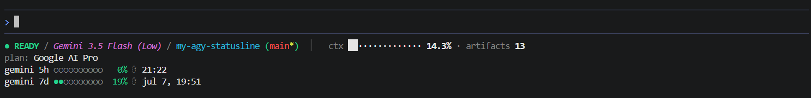
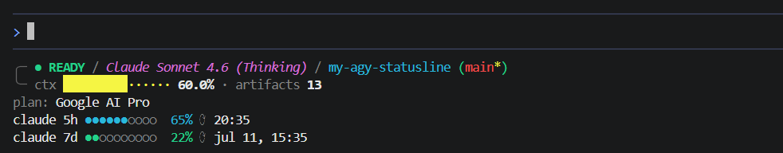
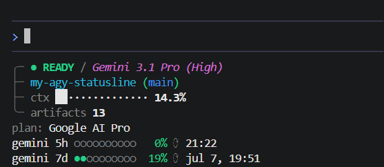
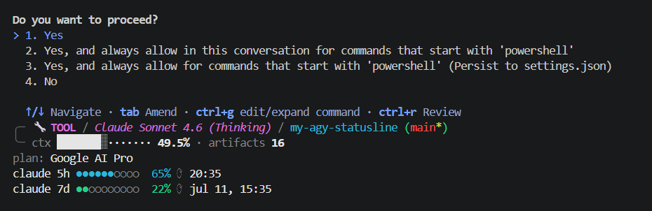

# my-agy-statusline

A statusline for the [Google Antigravity CLI](https://github.com/google-antigravity/antigravity-cli) (`agy`). It combines the rolling quota tracking from [Ranteck/agy-statusline](https://github.com/Ranteck/agy-statusline) with the agent metrics and state indicators from the [official example](https://github.com/google-antigravity/antigravity-cli/tree/main/examples/statusline), then adds responsive layout tiers, smart auto-hiding, and plan tier display.

No Python, no Node. Just a PowerShell script on Windows and a bash script everywhere else.

---

## Layouts

The script reads `terminal_width` from the agy payload and picks a layout automatically.

### Wide (>= 120 columns)

Everything on one line, quotas below.



```
● READY / Gemini 3.5 Flash (Low) / my-agy-statusline (main*)  │  ctx ░·············· 14.3% · artifacts 13
plan: Google AI Pro
gemini 5h ○○○○○○○○○○   0% ⟳ 21:22
gemini 7d ●●○○○○○○○○  19% ⟳ jul 7, 19:51
```

### Medium (>= 100 columns)

Two-line box layout.



```
╭─ ● READY / Claude Sonnet 4.6 (Thinking) / my-agy-statusline (main*)
╰─ ctx ████████·····  60.0% · artifacts 13
plan: Google AI Pro
claude 5h ●●●●●●●○○○  65% ⟳ 20:35
claude 7d ●●○○○○○○○○  22% ⟳ jul 11, 15:35
```

### Narrow (< 100 columns)

Four-line split — state and model on the first line, branch on the second, context bar on the third, stats on the fourth.



```
╭─ ● READY / Gemini 3.1 Pro (High)
├─ my-agy-statusline (main)
├─ ctx ░·············  14.3%
╰─ artifacts 13
plan: Google AI Pro
gemini 5h ○○○○○○○○○○   0% ⟳ 21:22
gemini 7d ●●○○○○○○○○  19% ⟳ jul 7, 19:51
```

---

## State indicators

| State | Badge |
|---|---|
| idle | `● READY` |
| thinking | `◆ THINKING` |
| working | `⚙ WORKING` |
| tool use | `🔧 TOOL` |
| other | `⏳ <STATE>` |



---

## Installation

**1. Clone the repo**

```bash
git clone https://github.com/dersual/my-agy-statusline.git
cd my-agy-statusline
```

**2. Run the installer**

On Windows (from PowerShell):

```powershell
./bin/install.ps1
```

On macOS / Linux:

```bash
chmod +x bin/install.sh
./bin/install.sh
```

Both scripts copy the statusline to `~/.gemini/` and update `~/.gemini/antigravity-cli/settings.json` to point to it. Restart `agy` after installing.

---

## Configuration

Optional. Create `~/.gemini/statusline.json` to override defaults:

```json
{
  "show_quota": true,
  "show_additional_stats": true,
  "hide_zero_stats": true,
  "show_state_indicator": true
}
```

| Option | Default | What it does |
|---|---|---|
| `show_quota` | `true` | Show 5h and weekly quota bars |
| `show_additional_stats` | `true` | Show artifacts, subagents, tasks, sandbox |
| `hide_zero_stats` | `true` | Hide stats that are zero |
| `show_state_indicator` | `true` | Show the state badge |

---

## Dependencies

| Platform | Requirements |
|---|---|
| Windows | PowerShell 5.1+, no external dependencies |
| macOS / Linux | bash, jq |

The `.sh` script handles both GNU `date` (Linux) and BSD `date` (macOS) for reset time formatting.

---

## Credits

- [Ranteck/agy-statusline](https://github.com/Ranteck/agy-statusline) for the quota tracking approach
- [antigravity-cli examples](https://github.com/google-antigravity/antigravity-cli/tree/main/examples/statusline) for the original statusline structure
